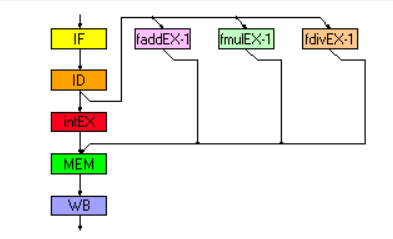
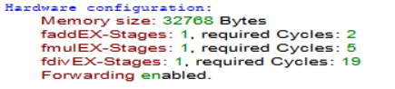
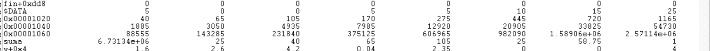
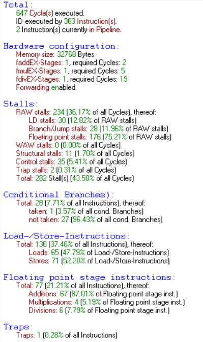
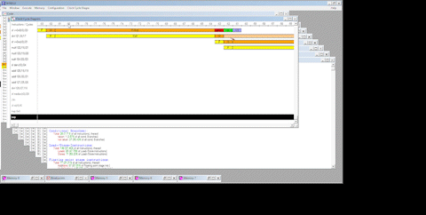
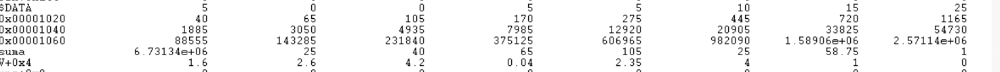
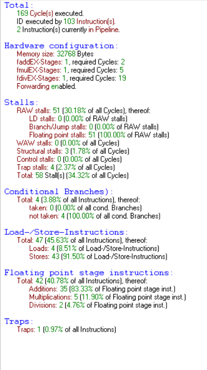
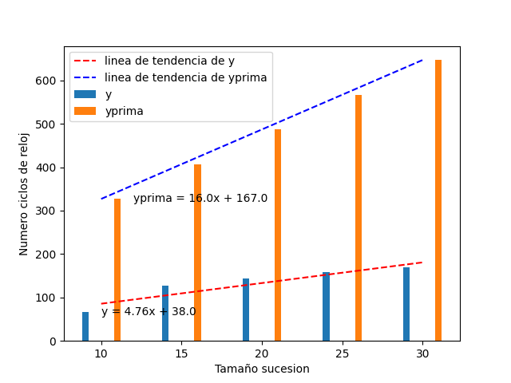

# README.md

Implementación de una variante de la secuencia de Fibonacci. Tras la secuencia, se calcula una matriz de la que se extrae su determinante y su media.

Posteriormente, se calcula otra matriz asociada a la anterior y se calcula su determinante y su media.

El programa pretende estudiar el paralelismo de ejecución de la pipeline segmentada de la arquitectura del procesador DlX.

## Configuración del entorno

En la carpeta utils se encuentra el archivo [SHELL](./utils/utils.sh) que permite compilar el código y ejecutarlo en el simulador de la arquitectura DlX.

Además en la propia carpeta de WINDLX se incluye el fichero [WINDLX.BAT](./utils/WINDLX/WINDLX.BAT) que permite ejecutar el simulador de la arquitectura DlX en Windows.

## Configuración del hardware

El hardware empleado para la realización de este trabajo es el siguiente:

- CPU DlX con 5 etapas de pipeline segmentada.

- 32 registros de propósito general (GPRs) de 32 bits y 32 registros en coma flotante (FPRs) (32 bits) que pueden ser empleados en pares como valores de doble precisión (64 bits).
- Memoria de direccionamiento por bytes, en modo big endian, con direcciones de 32 bits.
- Todas las instrucciones son de 32 bits y deben de estar alineadas.
- Existen unos pocos registros especiales que se pueden transferir desde o hacia los GPRs.

    

- El resto de la configuración del hardware es:

    

## Primera Implementación

Se realizó una primera implementación en con uso de subrutinas para cada uno de los apartados pedidos y el cálculo de la secuencia mediante la iteración en un bucle.
Realmente fue la manera menos eficiente de realizar el calculo puesto que por cada iteración tan sólo se realizaba un cálculo de la secuencia y se almacenaba en el vector dado.

Además cada uno de los cálculos de la secuencia se realizaba en una subrutina diferente, lo que provocaba que se tuviera que realizar un salto a la subrutina y posteriormente un retorno a la subrutina principal.

Se incluye a continuación la implementación del bucle que realizaba el cálculo de la secuencia.

```assembly
loop:                                                         ; inicio del bucle

    addi    r9,                     r9,             4
    lf      f2,                     vector-8(r9)
    lf      f3,                     vector-4(r9)
    addf    f4,                     f2,             f3
    sf      vector(r9),             f4
    addi    r10,                    r10,            1
    addf    f5,                     f5,             f4
    sf      suma,                   f5
    seq     r11,                    r10,            r8
    bnez    r11,                    calculoMatriz
    j       loop                                            ; iteramos

```

Se puede observar que computacionalmente es muy costoso realizar un calculo de la secuencia empleando un bucle que tan solo calcule un valor de la secuencia por iteración; sobre todo teniendo en cuenta que el procesador tiene que interpretar instrucciones de salto condicional, carga en memoria,almacenamiento, etc.

Imaginemos que se quieren calcular treinta valores de la secuencia. Este bucle realizará un total de 28 comprobaciones, de las cuales tomará 27. Además, por cada iteración se realizará un salto a la subrutina y un retorno a la subrutina principal.

Realmente se está desaprovechando el paralelismo de ejecución de la pipeline segmentada del procesador DlX.

El codigo completo de la primera implementación se encuentra en el archivo [UNOPTIMIZED.s](UNOPTIMIZED.s).

## Estadísticas

El resultado de la ejecución del programa se muestra a continuación:

Por un lado el código se ejecuta en un total de 647 ciclos de reloj.

El ID se ejecutó por 363 instrucciones.

Si se observa la memoria se verifica el correcto funcionamiento del programa.



Se incluye a continuación una imagen tanto de las estadísticas completas como del diagrama de ciclos de reloj.



Para el diagrama se incluye una animación en formato GIF, puesto que la imagen es demasiado grande debido a las paradas de la CPU como para incluirla en el documento.



Tal y como se puede observar en el diagrama de ciclos de reloj, las operaciones de división retienen al procesador por completo y al no haber reordenación de instrucciones de forma intencionada no se está explotando el paralelismo que ofrece la pipeline segmentada (Se estan sufriendo 234 stalls+paradas totales de operación aritmética por división).

Observando las estadísticas y tal y como se menciona antes hay también 28 paradas por salto.

En resumen 282 paradas hacen que el código no sea eficiente ni explote el paralelismo haciendo que tarde hasta 6 segundos en completar su cometido.

## Segunda Implementación

Para la segunda implementación se ha realizado una investigación más exhaustiva de las posibles vías de hacer el código más eficiente empleando propiedades de las matrices, propiedades de determinantes y propiedades de sucesiones aplicadas a la sucesión de Fibonacci tal y como se describirá a continuación.

### Propiedades de las matrices y determinantes

Siendo k escalar y A y B matrices cuadradas de orden n, se cumple que:

- $det(B)= det(k*A) = k^n det(A)$

Si se tiene en cuenta que la matriz asociada V se obtiene a partir de dividir por el determinante de la matriz A, y se asume que ese es el escalar por el que se obtiene la matriz V, se puede calcular el determinante de la matriz V de la siguiente manera:

- $\frac{1}{det(A)}=k$

- $k^n = (1/det(A))^2 = det(A)^-2$

- $det(V) = det(A)^-2* det(A) = det(A)^-1$

Se cumple que para toda matriz V asociada a una matriz A, el determinante de V es el inverso del determinante de A.

### Propiedades de la sucesión de Fibonacci

Para calcular la sucesion de Fibonacci debíamos prescindir de los bucles debido a que estos tienen un alto consumo ciclos de reloj, por lo tanto la forma mas eficiente adaptar el codigo a las necesidades que teniamos, para ello realizamos el calculo de los 30 numeros de la sucesion de finonacci linea a linea.

Para controlar si el tamaño de la prueba no es 30, colocamos branches que acabarán el codigo dependiendo del tamaño indicado. Esto aumenta los ciclos de reloj debido a que son mas instrucciones que deben ser procesadas, por otro lado hacemos esto ya que de otra forma el codigo no podría usarse para valores distintos de 30.

Para aumentar un poco mas la eficiencia hacemos uso de la progresion aritmetica con alguna modificacion para nuestro caso de uso

- $∑_(n=i)^n = F_i =F_(n+2)-1$

Con esa fórmula somos capaces de calcular la suma de todos los numeros de la sucesión de Fibonacci, por lo tanto, nos ahorramos una gran cantidad de operaciones de suma, reduciéndolo todo a una única suma.
Ahora bien, esta ecuación proviene de la siguiente:

- $∑_(n=i)^n = F_i =F_(n+2)-F_2$

Tiene la forma que habíamos puesto antes en el caso de estar hablando de una sucesión de Fibonacci que empezara en el 0..1, sin embargo en nuestro caso, F2 es 5 valor inicial por lo tanto el valor de la suma total será F32 (número de secuencia, registro f23) - valor inicial para el caso de tamaño 30.

Observando el algoritmo optimizado para el caso de tamaño 30:

```assembly
    addf    f23,            f22,            f21
    ...
    subf    f23,            f22,            f0
    sf      suma,           f23
```

Otra optimizacion que hemos realizado es aprovechar los tiempos de espera entre cada operación para realizar otras operaciones


Como podemos ver una suma consume 2 ciclos, pero una multiplicación consume 5, a lo que una division consume 19 ciclos. Este último es un consumo excesivo por lo tanto hemos limitado el uso de las divisiones al maximo. Se ha decidido intercambiar todas las operaciones de división por operaciones de multiplicación, ahorrando una gran cantidad de ciclos. Esto se debe a que es equivalente realizar una multiplicación por 0.25 a una division entre 4 por ejemplo.

Aun habiendo reducido el costo de operaciones matemáticas tenemos una parte importante del tiempo que no estamos realizando ningun instrucción, ya que esperamos a que acabe de realizarse la multiplicación para seguir.

Por ello hemos aprovechado este tiempo entre divisiones y multiplicaciones para añadir instrucciones `sf` para que así estas no aumenten los ciclos al realizarlas mas tarde.

Si se comprueba el almacenamiento en memoria, se verifica el correcto funcionamiento del programa.



El total de ciclos obtenidos en este caso es de 169 para los valores de la prueba dados.



### Grafica de ciclos de reloj

Se ha decidido realizar un estudio comparativo de la evolución del rendimiento en función del tamaño de la prueba.

Se ha elegido un tamaño de prueba de 10,15,20,25 y 30 y un valor inicial de 5 para ambos casos.

Se ha elaborado un pequeño script de python que genera un gráfico discreto de los ciclos de reloj en función del tamaño de la prueba.

El script se encuentra en el archivo [plot.py](utils/plot.py).



> Como podemos observar el código no optimizado tiene un alto número de ciclos de reloj fijos independientemente del tamaño de la prueba, lo que hace que incluso a valores bajos de tamaño tenga un numero elevado de ciclos.\
> Por otro lado, el código optimizado, tiene un número reducido de éstos ciclos fijos, por lo tanto, no condiciona al rendimiento final del programa.\
> Si nos fijamos en el multiplicador de la tendencia de los ciclos de reloj, podemos observar que el código no optimizado tiene una tendencia de crecimiento de 4.76 ciclos de reloj por cada unidad de tamaño de prueba, mientras que el código optimizado tiene una tendencia de crecimiento de 16 ciclos de reloj por cada unidad de tamaño de prueba.\
> Teniendo en cuenta estos valores se tiene un speedup de *3.36*, lo que significa que el código optimizado es 3.36 veces más rápido que el código no optimizado.\
> Es una medida más exacta que realizar la división de $ciclos_{no optimizado}/ciclos_{optimizado}$ ya que en este caso se tiene en cuenta el crecimiento de los ciclos de reloj en función del tamaño de la prueba.
